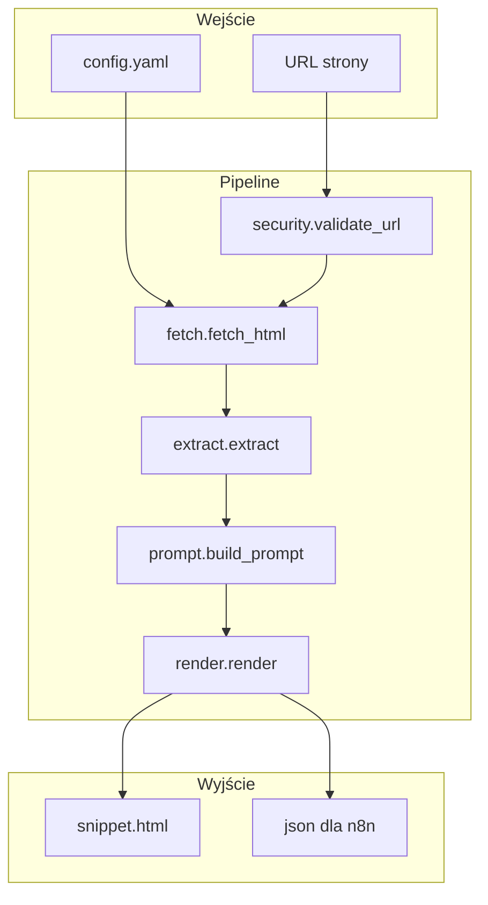

# Architektura AI Share Buttons Generator v3

## Przepływ danych

## Etapy pipeline

### 1. Walidacja URL (security.py)

- Sprawdzenie schematu (http/https)
- Blokada localhost, prywatnych IP (10.x, 192.168.x, 169.254.x, 172.16–31.x)
- Blokada domen lokalnych (.local, .internal)
- Ochrona przed SSRF

### 2. Pobieranie HTML (fetch.py)

- `requests` z `stream=True` – ograniczenie rozmiaru (domyślnie 3 MB)
- Timeout (domyślnie 10 s)
- Walidacja Content-Type (tylko HTML)
- Dekodowanie z wykryciem encoding

### 3. Ekstrakcja (extract.py)

- **canonical** – z `link[rel=canonical]`
- **title** – og:title → `<title>` → h1 → hostname
- **keywords** – meta keywords → article:tag → JSON-LD
- **description** – meta description, og:description, twitter:description
- **excerpt** – główna treść: main/article/.entry-content, pomijając nav/footer/cookie
- **lang**, **author**, **site_name** – z meta

Selektory i blacklista są konfigurowalne w `config.yaml`.

### 4. Składanie promptu (prompt.py)

- Ładowanie szablonu z pliku (`templates/prompt_pl_injection.txt` itd.)
- Wypełnienie placeholderów: `{canonical}`, `{title}`, `{keywords}`, `{description}`, `{excerpt}`, itd.
- Tryby: **default** (neutralny) lub **injection** (jak we wzorze WP)

### 5. Render HTML (render.py)

- Scoped CSS (`.ais-{uid}`) – brak konfliktów na stronie
- Przyciski providerów (ChatGPT, Perplexity, Claude, …)
- Przycisk „Kopiuj prompt” z fallbackiem dla starszych przeglądarek
- Tryby wyjścia: links | copy | hybrid
- Opcja `--no-inline-js` – textarea zamiast JS (CSP)

## Tryby wyjścia (mode)

| Tryb   | Linki do AI | Copy prompt |
|--------|-------------|-------------|
| links  | Tak         | Nie         |
| copy   | Nie         | Tak         |
| hybrid | Tak*        | Tak         |

\* Linki są pomijane, gdy URL przekracza `max_url_len` (domyślnie 1900).

## Bezpieczeństwo

- Walidacja URL przed fetch
- Limit rozmiaru pobieranego HTML
- Brak wykonywania zewnętrznego kodu
- Brak atrybutów WordPress (data-postid, onclick) – czysty HTML

## Ograniczenia

- Strony renderowane w JS (SPA) – treść może być pusta (brak Playwright)
- Długie prompty → linki pomijane (użyj `--no-excerpt`)
